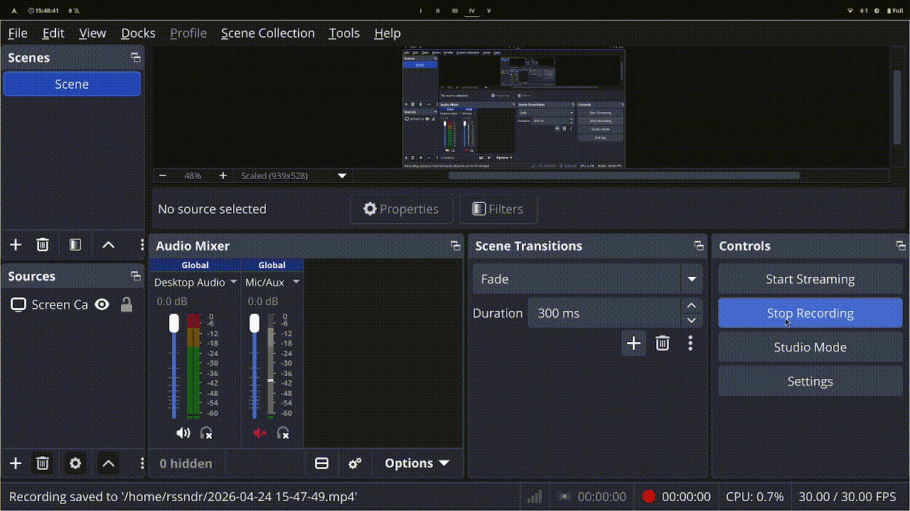

# Cinit - C Project Initializer

Cinit is a simple bash script designed to initialize new projects with a set of default files and a customized license. It automates the setup process, allowing users to quickly start coding with a standardized structure. Templates are organized into **profiles**, so different kinds of projects can each have their own file set and default license.

More details on my website: [andrearossetti.me](https://andrearossetti.me/projects/cinit)

## Installation

1. Clone the repository or download the files to your local machine:
   ```bash
   git clone https://github.com/rssndr/cinit.git
   cd cinit
   ```
2. Run the installation script with sudo privileges:
   ```bash
   ./install.sh
   ```
   - You will be prompted to enter your name, which will be used for the copyright notice in the license.
   - The script sets up the global configuration file (`~/.config/cinit/cinit.conf`), copies the profiles and license templates, and installs the `cinit` command to `/usr/local/bin/`.

## Configuration Layout

```
~/.config/cinit/
├── cinit.conf            # Global settings: OWNER_NAME, DEFAULT_PROFILE
├── profiles/
│   └── c/                # A profile (the default one shipped with cinit)
│       ├── profile.conf  # This profile's defaults: LICENSE, FILES
│       └── files/        # The files scaffolded by this profile
└── templates/
    └── licenses/         # License templates, shared by all profiles
```

Separation of concerns:
- The **global** `cinit.conf` holds only `OWNER_NAME` and `DEFAULT_PROFILE`.
- Each **profile's** `profile.conf` holds only that profile's `LICENSE` and `FILES`.
- **License templates** are shared by all profiles under `templates/licenses/`.

To add your own profile, create `~/.config/cinit/profiles/<name>/` with a `profile.conf` and a `files/` directory.

## Usage

To initialize a new project in the current directory using your default profile, simply run:
```bash
cinit
```

Settings are resolved in this order:
1. The global `~/.config/cinit/cinit.conf` is loaded (`OWNER_NAME`, `DEFAULT_PROFILE`).
2. The profile is selected: `--profile=<name>` if given, otherwise `DEFAULT_PROFILE`.
3. The profile's `profile.conf` is loaded (`LICENSE`, `FILES`).
4. Per-run flags (`--owner=`, `--license=`, `--files=`, `--year=`, `--name=`) override everything above.
5. The profile's files are copied into the current directory with token substitution applied.

With the shipped `c` profile this will:
- Copy the default files (Makefile, .gitignore, main.c, README.md) from `~/.config/cinit/profiles/c/files/` to the current directory.
- Generate a LICENSE file based on the profile's license (MIT for the `c` profile) from `~/.config/cinit/templates/licenses/`, dynamically inserting your name and the current year.

If the selected profile does not exist, cinit exits with an error; run `cinit --list` to see the available profiles.

### Options

Per-run options (affect only the current invocation):
- `--profile=<name>`            Selects the profile for this run.
- `--name=<name>`               Sets the project name (default: current directory name).
- `--owner=<name>`              Sets the owner name for this repo.
- `--license=<type>`            Specifies the license.
- `--files=<list>`              Defines which files to include.
- `--year=<year>`               Sets a specific copyright year.
- `--list`                      Lists available profiles.

Persistent options (update configuration and exit):
- `--default-owner=<name>`      Permanently change the default owner (written to the global `cinit.conf`).
- `--default-profile=<name>`    Permanently change the default profile (written to the global `cinit.conf`; the profile must exist).
- `--default-license=<type>`    Permanently change the **active profile's** license (written to that profile's `profile.conf`).
- `--default-files=<list>`      Permanently change the **active profile's** files list (written to that profile's `profile.conf`).

Note: `--default-license=` and `--default-files=` target the active profile — that is, the profile named by a `--profile=` flag in the same invocation (in either argument order), or your `DEFAULT_PROFILE` otherwise. They never touch the global `cinit.conf`.

Examples:
- `cinit`
- `cinit --profile=c --owner="John Doe" --license=MIT`
- `cinit --default-profile=c`
- `cinit --profile=c --default-files="main.c LICENSE"`

Help:
- `cinit --help`                 Shows info on usage and options.

The resulting directory will contain the specified files, with a customized LICENSE reflecting the provided options.

## Template Tokens

Every copied file (not just the LICENSE) goes through a substitution pass that replaces the following namespaced tokens:

| Token           | Replaced with                                              |
|-----------------|------------------------------------------------------------|
| `{CINIT_OWNER}` | The owner name (`OWNER_NAME`, or `--owner=`)               |
| `{CINIT_YEAR}`  | The current year (or `--year=`)                            |
| `{CINIT_NAME}`  | The project name (directory name by default, or `--name=`) |

The `CINIT_` prefix keeps the tokens collision-safe: template files can freely contain things like CMake's `${PROJECT_NAME}` without being corrupted by substitution. Files that contain no `{CINIT_*}` tokens are copied byte-for-byte.

## Current Features
- **Profiles**: Each project type gets its own profile with its own default license and file set; switch per run with `--profile=` or persistently with `--default-profile=`.
- **Dynamic License Generation**: The LICENSE file is created each time from a shared template, replacing `{CINIT_OWNER}` with your name (set during installation) and `{CINIT_YEAR}` with the current year.
- **Token Substitution Everywhere**: All scaffolded files support the `{CINIT_OWNER}`, `{CINIT_YEAR}`, and `{CINIT_NAME}` tokens.
- **Configurable Setup**: Global defaults in `~/.config/cinit/cinit.conf`, per-profile defaults in each `profile.conf`. Defaults or project-specific settings can be modified with command-line arguments.
- **Default Templates**: Provides a pre-defined set of files for new C projects out of the box.

## Demo


## Contributing
Feel free to fork this repository, make improvements, and submit pull requests. Suggestions for new features or bug reports are welcome!

## License
This project itself is licensed under the MIT License. See the included LICENSE file for details.
